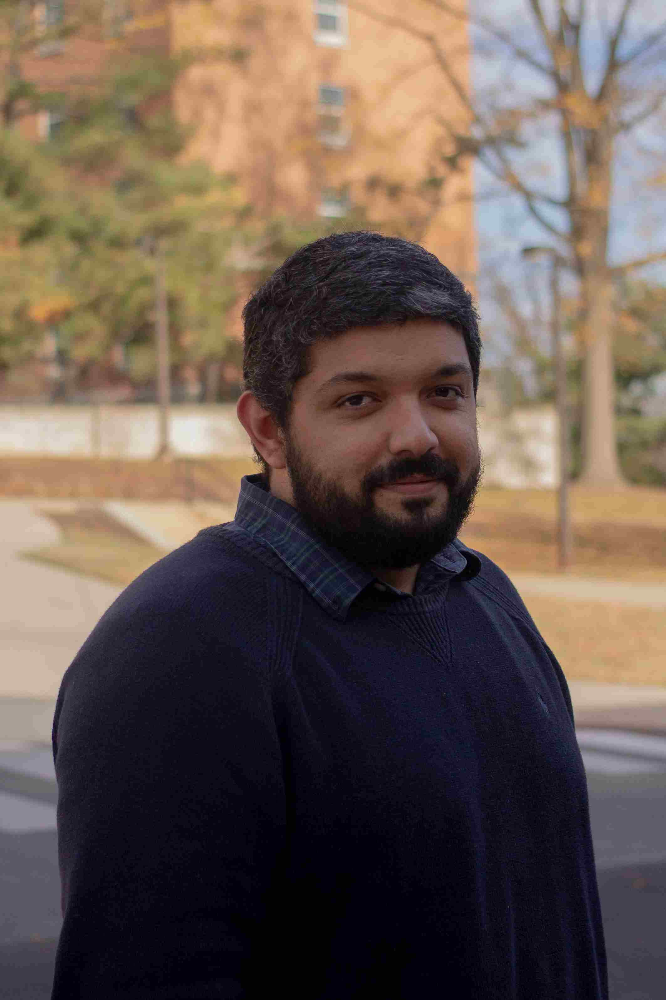

# About Me

I am a Ph.D. student in the Atmospheric and Oceanic Sciences department at the University of Maryland, College Park, in Dr. Jacob Wenegrat’s group. My work is focused on air-sea interaction at submesoscale using observations and coupled model simulations, more precisely on current and thermal feedbacks. I am currently part of NASA’s S-MODE project. 

For my personal interests, I enjoy learning new languages, playing video games, and illustrating. 

My future goals towards Physical Oceanography and Academia are focused on pedagogically improving Geophysical Fluid Dynamics learning.

# Publications

**Uchoa, I.**, Simoes-Sousa, I. T., & da Silveira, I. C. (2023). The Brazil Current mesoscale eddies: Altimetry-based characterization and tracking. Deep Sea Research Part I: Oceanographic Research, 192.

Silveira, I. C. A., Napolitano, D. C., & **Farias, I. U.** (2020). Water masses and oceanic circulation of the Brazilian Continental Margin and adjacent abyssal plain. Brazilian Deep-Sea Biodiversity, 7-36.

Bonecker, A. C. T., Katsuragawa, M., de Castro, M. S., Namiki, C., de Lourdes Zani‐Teixeira, M., **Farias, I. U.**, & Silveira, I. C. A. D. (2019). Seasonal variability of ichthyoneuston assemblage on the continental shelf and slope of the Southwest Atlantic Ocean, Brazil (20–23 S). Journal of Applied Ichthyology, 35(3), 655-671.

# Posters & Presentations
Presentation: [Submesoscale sea surface temperature variability as a sink of
eddy energy in a coupled model](./assets/Ocean_Lunch_Seminar_.pdf)

# Get in touch
[**Google Scholar **](https://scholar.google.com/citations?user=d-DszkwAAAAJ&hl=en)

[**Curriculum Vitae**](./assets/Igor_s_CV.pdf)

**Email:** iufarias@umd.edu

**Github:** [igoruchoa](https://github.com/igoruchoa)

**LinkedIn**: [linkedin.com/igoruf](https://www.linkedin.com/in/igoruf/)
